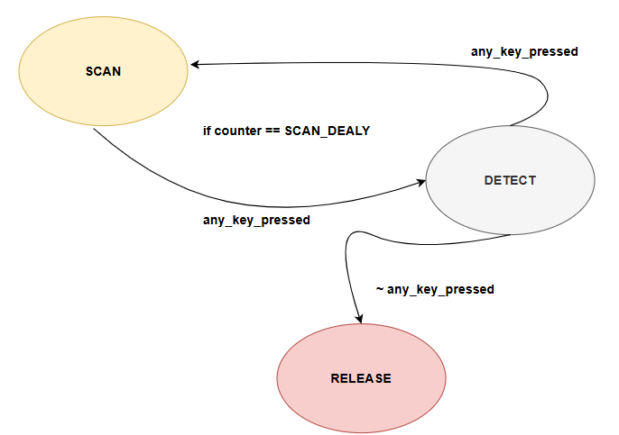
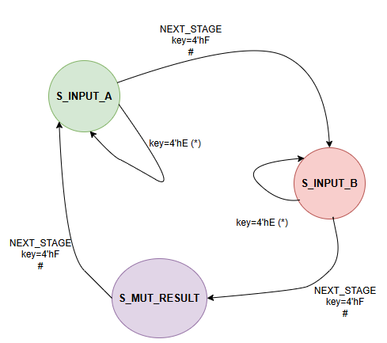

# Tercer proyecto, diseño lógico, Algoritmo de Booth- Multiplicador con signo, elaborado por: Abner López Méndez y Justin Garita Serrano 

## 1. Funcionamiento general del circuito y explicación de cada modulo:
- **Introducción**: El proyecto consiste en el diseño e implementación de una calculadora decimal en VHDL específicamente en SystemVerilog, desarrollada para una FPGA (la Tang Nano 9K). El sistema permite al usuario ingresar dos números decimales de tres dígitos mediante un teclado matricial hexadecimal 4x4, realizar su suma en formato BCD y visualizar tanto los números ingresados como el resultado de la operación en un display de 7 segmentos de 4 dígitos.
El sistema consta de tres subsistemas principales:
keypad scanner: detecta la tecla presionada por el usuario y genera un código BCD correspondiente. Se implementa un detector de flanco (key_pressed) para evitar múltiples registros de una misma tecla.
Control lógico (FSM): una máquina de estados finitos gestiona el flujo de operación del sistema, desde la captura del primer número (A), el segundo número (B), hasta la visualización de la suma. Las teclas especiales permiten avanzar entre estados (#) o reiniciar el sistema (*).
Procesamiento y visualización:
Los números se almacenan en formato BCD (unidades, decenas y centenas).
Un módulo sumador realiza la operación en BCD, generando un resultado de hasta 4 dígitos (miles, centenas, decenas, unidades).
Un sistema de multiplexado de displays permite mostrar dinámicamente los dígitos en los 4 displays de 7 segmentos.
El diseño está pensado para operar con un reloj de 27 MHz y fue desarrollado con una estructura modular clara que facilita la síntesis y carga en una FPGA.

## 2. Definición general del problema, de los objetivos buscados y de las especificaciones planteadas en el enunciado:
En este proyecto se pide implementar un sistema digital integrado capaz de realizar operaciones aritméticas básicas con entrada mediante teclado matricial y visualización en displays de 7 segmentos, resolviendo los desafíos típicos en el desarrollo de interfaces de usuario. El problema principal radica en coordinar tres subsistemas clave: la captura confiable de entradas mediante un teclado matricial 4x4 (considerando el filtrado de rebotes), el procesamiento aritmético en formato BCD (para mantener precisión decimal) y la visualización multiplexada en displays de 7 segmentos (que demanda refresco constante). Los objetivos específicos incluyen diseñar una calculadora básica que permita ingresar números de hasta 3 dígitos, realizar sumas BCD correctamente y mostrar resultados de hasta 4 dígitos, implementando técnicas robustas de sincronización y control de estados. Las especificaciones técnicas requieren operación a 27 MHz con reset asíncrono, manejo de entradas mediante un teclado matricial con teclas numéricas (0-9) y de control, visualización estable en displays de 7 segmentos con refresco a aproximadamente 1 kHz, y capacidad para sumar valores entre 0-999 produciendo resultados correctos en el rango 0-1998. El diseño debe ser eficiente en el uso de recursos lógicos, optimizado para implementación en FPGAs, cumpliendo con requisitos de consumo de potencia y área mediante técnicas de diseño modular y sincronización precisa de señales.

## 3. Explicación de los modulos:
- **Módulo de lectura del teclado**: Encabezado del módulo
```SystemVerilog
module keypad_scanner (
    input clk, 
    input [3:0] row, 
    output logic [3:0] key = 4'h0, 
    output logic key_pressed = 0
    output logic [3:0] col = 4'b0111,
);
```
Este módulo tiene como entradas el reloj del sistema, y las filas del teclado hexadecimal y como salidas la tecla ingresada codificada, las columnas del teclado y una bandera de cual es la tecla que se presionó.
```SystemVerilog
    parameter SCAN_DELAY = 1350;

    localparam SCAN = 2'b00;
    localparam WAIT = 2'b01;
    localparam DETECT = 2'b10;

    logic [1:0] state = SCAN;
    logic [1:0] col_select = 0;
    logic [15:0] counter = 0;
    logic [3:0] last_row;
    logic [3:0] row_debounced;
    logic [3:0] row_pressed;

    // Instancias del módulo debounce 
    debounce db_inst0 (
        .clk(clk),
        .rst(1'b1),
        .key(~row[0]),
        .key_pressed(row_pressed[0])
    );
    assign row_debounced[0] = ~row_pressed[0];

    debounce db_inst1 (
        .clk(clk),
        .rst(1'b1),
        .key(~row[1]),
        .key_pressed(row_pressed[1])
    );
    assign row_debounced[1] = ~row_pressed[1];

    debounce db_inst2 (
        .clk(clk),
        .rst(1'b1),
        .key(~row[2]),
        .key_pressed(row_pressed[2])
    );
    assign row_debounced[2] = ~row_pressed[2];

    debounce db_inst3 (
        .clk(clk),
        .rst(1'b1),
        .key(~row[3]),
        .key_pressed(row_pressed[3])
    );
    assign row_debounced[3] = ~row_pressed[3];

    always @(posedge clk) begin
        key_pressed <= 0;

        case (state)
            SCAN: begin
                col_select <= col_select + 1;
                case (col_select)
                    2'b00: col <= 4'b0111;
                    2'b01: col <= 4'b1011;
                    2'b10: col <= 4'b1101;
                    2'b11: col <= 4'b1110;
                endcase
                counter <= 0;
                state <= WAIT;
            end

            WAIT: begin
                if (counter == SCAN_DELAY) begin
                    state <= DETECT;
                    counter <= 0;
                end else begin
                    counter <= counter + 1;
                end
            end

            DETECT: begin
                if (row_debounced != 4'b1111) begin
                    last_row <= row_debounced;

                    case ({col_select, row_debounced})
                        6'b00_1110: key <= 4'h1;
                        6'b00_1101: key <= 4'h4;
                        6'b00_1011: key <= 4'h7;

                        6'b11_1110: key <= 4'h2;
                        6'b11_1101: key <= 4'h5;
                        6'b11_1011: key <= 4'h8;
                        6'b11_0111: key <= 4'h0;

                        6'b10_1110: key <= 4'h3;
                        6'b10_1101: key <= 4'h6;
                        6'b10_1011: key <= 4'h9;
                        6'b10_0111: key <= 4'hF;

                        6'b01_1110: key <= 4'hA;
                        6'b01_1101: key <= 4'hB;
                        6'b01_1011: key <= 4'hC;
                        6'b01_0111: key <= 4'hD;
                    endcase
                    
                    key_pressed <= 1;
                end
                state <= SCAN;
            end
        endcase
    end
endmodule

```
Este módulo implementa un escáner para el teclado 4x4 que se utilizó, instanciando por cada fila el módulo de anti-rebote que se explicará más adelante. Funciona activando secuencialmente cada una de las cuatro columnas del teclado (señal col, activas en bajo) mientras monitorea el estado de las cuatro filas (señal row). Cuando detecta una pulsación (fila activa en bajo), utiliza una máquina de estados de tres estados: SCAN (cambio de columna), WAIT (retardo de estabilización SCAN_DELAY) y DETECT (decodificación de tecla).
Cada fila pasa por un módulo debounce independiente para eliminar ruido mecánico, generando señales estables en row_debounced. La combinación de la columna activa (col_select) y la fila presionada se traduce a un código hexadecimal de 4 bits (key), con valores del 0x0 al 0xF. La salida key_pressed se activa durante un ciclo de reloj al detectar una tecla válida.


- **Módulo de eliminación de rebote**: Encabezado del módulo
```SystemVerilog
module debounce (
    input  logic clk,          
    input  logic rst,        
    input  logic key,     
    output logic key_pressed     
);
```
Este módulo tiene como entradas el reset, el reloj del sistema, la tecla con la señal inestable y como salida la palabra ya estable lista para utilizar en los demás modulos.
```SystemVerilog
    logic [16:0]  count;    
    logic estable;           
    logic ff_1, ff_2, ff_3, ff_4;
    
    always_ff @(posedge clk or negedge rst) begin
        if (!rst) begin
            ff_1 <= 1'b0; 
            ff_2 <= 1'b0;
            ff_4 <= 1'b0;
        end else begin
            ff_1 <= key;
            ff_2 <= ff_1;
            ff_4 <= ff_2;
        end
    end

    assign estable = ff_1 & ff_2 & ff_4;

    always_ff @(posedge clk or negedge rst) begin
        if (!rst) begin
             count <= '0; 
             ff_3 <= 1'b0;
        end else begin
            if (estable) begin           
                if ( count == 3'b100) begin        
                     count <= '0;
                    ff_3 <= 1'b1; 
                end else begin
                     count <=  count + 1'b1;
                    ff_3 <= 1'b0;
                end
            end else begin
                 count <= '0;
                ff_3 <= 1'b0;
            end
        end
    end
```
Este módulo elimina los rebotes (señal ruidosa) de botones mecánicos mediante un filtrado digital. Sincroniza la señal de entrada (key) con el reloj (clk) usando flip-flops, luego valida que el estado se mantenga estable durante 4 ciclos de reloj antes de registrar la pulsación en key_pressed. Incluye un reset (rst) para inicialización y es ideal para sistemas con relojes rápidos (como 27 MHz), garantizando que solo se detecten pulsaciones reales y evitando falsos triggers por vibraciones mecánicas.

- **Módulo de multiplexación de 7 segmentos**: Encabezado del módulo
```SystemVerilog
module display_mux (
    input clk,
    input [15:0] data,
    output logic [3:0] anodes,
    output [6:0] seg
);
```
Este módulo tiene como entradas el reloj del sistema, el número de 16 bits dividido en 4 numeros de 4 bits, miles, centenas, decenas y unidades. Cuenta con 4 salidas, para cada uno de los 4 displays de 7 segmentos controlados cada uno con un transistor PNP 2N4403, y la otra salida es cada uno de los 7 segmentos. 
```SystemVerilog
 logic [1:0] digit_select = 0;
    logic [3:0] current_digit;
    logic [15:0] refresh_counter = 0;
    
    hex_to_7seg converter(.hex(current_digit), .seg(seg));
    
    always @(posedge clk) begin
        refresh_counter <= refresh_counter + 1;
        
        if (refresh_counter == 27000) begin // ~1kHz @27MHz
            refresh_counter <= 0;
            digit_select <= digit_select + 1;
            
            case (digit_select)
                2'b00: begin anodes <= 4'b1110; current_digit <= data[3:0]; end
                2'b01: begin anodes <= 4'b1101; current_digit <= data[7:4]; end
                2'b10: begin anodes <= 4'b1011; current_digit <= data[11:8]; end
                2'b11: begin anodes <= 4'b0111; current_digit <= data[15:12]; end
            endcase
        end
    end
endmodule
```
Este módulo implementa un multiplexor para controlar un display de 4 dígitos de 7 segmentos mediante barrido (multiplexación temporal). Trabaja con un reloj de sistema (27MHz) y alterna cíclicamente entre los cuatro dígitos a una frecuencia de aproximadamente 1kHz (cambiando cada 27,000 ciclos), activando secuencialmente cada ánodo (señal anodes, activo en bajo) mientras envía al bus común de segmentos (seg) el valor correspondiente del dato de entrada de 16 bits (data), convertido a código 7 segmentos mediante el módulo hex_to_7seg. El sistema divide el dato de entrada en cuatro nibbles (de 4 bits cada uno) que representan dígitos decimales, mostrándolos en rápida sucesión para crear la ilusión de visualización continua gracias a la persistencia visual (aproximadamente 250Hz por cada display). Esta técnica permite controlar múltiples dígitos con un mínimo de pines, optimizando los recursos del FPGA.

- **Modulo de conversión de hexadecimal a 7 segmentos**: Encabezado del módulo
```SystemVerilog
module hex_to_7seg (
    input [3:0] hex,
    output reg [6:0] 
);
```
Este módulo tiene como entrada las teclas en hexadecimal, y como salida esas mismas palabras pero codificadas para un display de 7 segmentos
```SystemVerilog
    always @(hex) begin
        case (hex)
            4'h0: seg = 7'b1000000;
            4'h1: seg = 7'b1111001; 
            4'h2: seg = 7'b0100100; 
            4'h3: seg = 7'b0110000; 
            4'h4: seg = 7'b0011001; 
            4'h5: seg = 7'b0010010; 
            4'h6: seg = 7'b0000010; 
            4'h7: seg = 7'b1111000; 
            4'h8: seg = 7'b0000000; 
            4'h9: seg = 7'b0010000;
            4'hA: seg = 7'b0001000; 
            4'hB: seg = 7'b0000011; 
            4'hC: seg = 7'b1000110; 
            4'hD: seg = 7'b0100001; 
            4'hE: seg = 7'b1111110; 
            4'hF: seg = 7'b0111111; 

            default: seg = 7'b1111111; 
        endcase
    end         
endmodule
```
Este módulo convierte un valor hexadecimal de 4 bits (0-F) en su correspondiente patrón de encendido para un display de 7 segmentos, donde cada bit de la salida seg controla un segmento específico. Utiliza una lógica combinacional mediante una sentencia case que mapea cada valor hexadecimal a su configuración de segmentos correspondiente, activando los segmentos necesarios para formar el dígito deseado (el display es de ánodo común ). Por ejemplo, el valor 4'h0 (0 en hexadecimal) se traduce a 7'b1000000, lo que enciende todos los segmentos excepto el 'g', formando el número 0 en el display. El módulo incluye un caso default que apaga todos los segmentos si el valor de entrada no está en el rango esperado, asegurando un comportamiento predecible incluso con entradas no definidas.

- **Módulo de suma**: Encabezado del módulo
```SystemVerilog
module bcd_sumador (
    input [11:0] bcd_1,  
    input [11:0] bcd_2,
    output [15:0] resultado_bcd  
); 
```
Este módulo tiene como entradas los números de 3 digitos y como salida la suma correspondiente de ambos números.

```SystemVerilog
    logic [3:0] unidades_1 = bcd_1[3:0];
    logic [3:0] decenas_1 = bcd_1[7:4];
    logic [3:0] centenas_1 = bcd_1[11:8];

    logic [3:0] unidades_2 = bcd_2[3:0];
    logic [3:0] decenas_2 = bcd_2[7:4];
    logic [3:0] centenas_2 = bcd_2[11:8]; 
    
    logic [4:0] suma_unidades = unidades_1 + unidades_2;
    logic [3:0] unidades_final = (suma_unidades > 9) ? suma_unidades - 10 : suma_unidades;
    logic acarreo_unidades = (suma_unidades > 9);

    logic [4:0] suma_decenas = decenas_1 + decenas_2 + acarreo_unidades;
    logic [3:0] decenas_final = (suma_decenas > 9) ? suma_decenas - 10 : suma_decenas;
    logic acarreo_decenas = (suma_decenas > 9);

    logic [4:0] suma_centenas = centenas_1 + centenas_2 + acarreo_decenas;
    logic [3:0] centenas_final = (suma_centenas > 9) ? suma_centenas - 10 : suma_centenas;
    logic acarreo_centenas = (suma_centenas > 9);

    assign resultado_bcd = {acarreo_centenas, centenas_final, decenas_final, unidades_final};
endmodule 
```
 Este sumador BCD realiza la suma de dos números de 3 dígitos BCD (cada uno representado en 12 bits, organizados en grupos de 4 bits para centenas, decenas y unidades) y produce un resultado de 4 dígitos BCD (16 bits, incluyendo posibles miles). El módulo opera en tres fases principales: primero suma las unidades de ambos números, ajustando el resultado si excede 9 (resta 10 y genera un acarreo); luego suma las decenas junto con el acarreo anterior, realizando el mismo ajuste; finalmente repite el proceso para las centenas. El acarreo final de las centenas se convierte en el dígito de miles, permitiendo representar resultados hasta 1998. La salida (resultado_bcd) organiza los cuatro dígitos BCD (miles, centenas, decenas y unidades) en un bus de 16 bits, manteniendo la precisión decimal sin necesidad de conversiones adicionales.

- **Modulo principal**: Encabezado del módulo
```SystemVerilog
module top(
    input logic clk,         // Reloj de 27 MHz
    input logic rst,         // Reset activo en bajo
    output logic [3:0] an,   // Ánodos del display (asumiendo 4 dígitos para el resultado)
    output logic [6:0] seg,  // Segmentos del display
    output logic [3:0] columnas, // Columnas del teclado
    input logic [3:0] filas    // Filas del teclado
);
```
Este módulo tiene como entrada la señal de reloj, el reset, y las filas. Como salidas tiene la informacion para cada uno de los 4 ánodos, para los 7 segmentos, para las 4 columnas.

```SystemVerilog
    logic [3:0] key;
    logic key_pressed;
    logic key_pressed_prev; 
    logic key_strobe;       

    typedef enum logic [1:0] {
        STATE_INPUT_A,      
        STATE_INPUT_B,      
        STATE_SHOW_SUM     
    } operation_state_t;

    operation_state_t current_state, next_state;

    logic [3:0] A0, A1, A2; 
    logic [3:0] B0, B1, B2; 
    logic [15:0] sum_result; 
    logic [15:0] display_data;

    keypad_scanner scanner(
        .clk(clk),
        .col(columnas),
        .row(filas),
        .key(key),         
        .key_pressed(key_pressed) 
    );

    always_ff @(posedge clk or negedge rst) begin
        if (!rst) begin
            key_pressed_prev <= 1'b0;
            key_strobe <= 1'b0;
        end else begin
            key_pressed_prev <= key_pressed;
            // key_strobe es alto solo si key_pressed es alto AHORA y era bajo ANTES
            key_strobe <= key_pressed && !key_pressed_prev;
        end
    end

    always_ff @(posedge clk or negedge rst) begin
        if (!rst) begin
            current_state <= STATE_INPUT_A; 
            A0 <= 4'd0; A1 <= 4'd0; A2 <= 4'd0;
            B0 <= 4'd0; B1 <= 4'd0; B2 <= 4'd0;
        end else begin
            current_state <= next_state; 

            if (key_strobe) begin
                case (key)
                    4'hE: begin
                        A0 <= 4'd0; A1 <= 4'd0; A2 <= 4'd0;
                        B0 <= 4'd0; B1 <= 4'd0; B2 <= 4'd0;
                    end
                    4'hF: begin
                    end
                    default: begin
                        if (current_state == STATE_INPUT_A) begin
                            A2 <= A1;
                            A1 <= A0;
                            A0 <= key; 
                        end else if (current_state == STATE_INPUT_B) begin
                            B2 <= B1;
                            B1 <= B0;
                            B0 <= key; 
                        end
                    end
                endcase
            end
        end
    end
    always_comb begin
        next_state = current_state; 

        if (!rst) begin 
           next_state = STATE_INPUT_A;
        end else if (key_strobe) begin 
            case (key)
                4'hE: begin 
                    next_state = STATE_INPUT_A;
                end
                4'hF: begin
                    case (current_state)
                        STATE_INPUT_A: next_state = STATE_INPUT_B; 
                        STATE_INPUT_B: next_state = STATE_SHOW_SUM; 
                        STATE_SHOW_SUM: next_state = STATE_INPUT_A; 
                        default: next_state = STATE_INPUT_A; 
                    endcase
                end
                default: begin
                  
                    if (current_state == STATE_SHOW_SUM) begin
                         next_state = STATE_INPUT_A;
                    end else begin
                         next_state = current_state; 
                    end
                end
            endcase
        end
    end
    logic [11:0] bcd_A = {A2, A1, A0};
    logic [11:0] bcd_B = {B2, B1, B0};

    bcd_sumador sumador (
        .bcd_1(bcd_A),
        .bcd_2(bcd_B),
        .resultado_bcd(sum_result) 
    );
    always_comb begin
        case (current_state)
            STATE_INPUT_A:  display_data = {4'd0, A2, A1, A0}; 
            STATE_INPUT_B:  display_data = {4'd0, B2, B1, B0};
            STATE_SHOW_SUM: display_data = sum_result;        
            default:        display_data = 16'hFFFF;           
        endcase
    end
    display_mux display (
        .clk(clk),
        .data(display_data), 
        .anodes(an),         
        .seg(seg)          
    );
endmodule

```
Este módulo principal integra todos los componentes del sistema (teclado, sumador BCD y display) para crear una calculadora básica de 3 dígitos. Opera con una máquina de estados de 3 fases: STATE_INPUT_A (captura el primer número), STATE_INPUT_B (captura el segundo número) y STATE_SHOW_SUM (muestra el resultado). El sistema utiliza un teclado matricial 4x4 (controlado por keypad_scanner) donde las teclas numéricas (0-9) ingresan dígitos (almacenados en registros de desplazamiento para A y B), '*' reinicia la calculadora, y '#' avanza entre estados. Cuando se completa la entrada, el sumador BCD (bcd_sumador) procesa los números y genera un resultado de 4 dígitos (incluyendo acarreo). El multiplexor de display (display_mux) muestra dinámicamente el número actual (A, B o resultado) en un display de 7 segmentos, alternando rápidamente entre dígitos. Un detector de flancos en key_pressed asegura que cada tecla se registre una sola vez, mientras que la lógica combinacional controla las transiciones de estado y la selección de datos para visualización. 

## 4. Diagramas de bloques de cada subsistema y su funcionamiento fundamental.

Anti reobte. [Ver pdf del Debounce](assets/debounce.pdf)

 

Escáner del teclado. [Ver pdf del keypad_scanner](assets/key_scanner.pdf)


Multiplexación para los 7 segmentos. [Ver pdf del Display Mux](assets/display_mux.pdf)


Módulo de los 7 segementos. [Ver pdf del Hex to 7seg](assets/hex_to_7seg.pdf)


Módulo encargado para pasar el número de BCD a binario. [Ver pdf del BCD_to_bin](assets/bcd_to_bin.pdf)


Módulo encargado para pasar el número de binario a BCD. [Ver pdf del bin_to_BCD](assets/bin_to_bcd.pdf)


Módulo encargado de realizar la multiplicación. [Ver pdf de la FSM_BOOTH](assets/booth_multiplier.pdf)


Módulo Top. [Ver pdf del Top](assets/top.pdf)

Este módulo al ser tan grande no se pudo redimensionar


## 5. Diagramas de estado de las FSM diseñadas, según descritos en la sección anterior.

#### Máquina de estado para el escáner del teclado
Esta FSM controla el escaneo del teclado matricial 4x4.


#### Máquina de estado del top
Según el estado actual, decides si registrar un número, hacer la multiplicación, mostrar el resultado o reiniciar.


#### Máquina de estado para la multiplicación
Se realiza una multiplicación de dos números con signo usando el algoritmo de Booth controlado por una FSM secuencial.


## 6. Ejemplo y análisis de una simulación funcional del sistema completo, desde el estímulo de entrada hasta el manejo de los 7 segmentos.


```Verilog
VCD info: dumpfile simulation.vcd opened for output.
Ingresando número A: 123
Presionando tecla:  3
Presionando tecla:  2
Presionando tecla:  1
Presionando tecla especial: f (#)
Ingresando número B: 456
Presionando tecla:  6
Presionando tecla:  5
Presionando tecla:  4
Presionando tecla especial: f (#)
Verificando suma: 123 + 456 = 579
~~~~~~~~~~Reiniciando...~~~~~~~~~~
Presionando tecla especial: e (*)
Ingresando nuevo número A: 789
Presionando tecla:  9
Presionando tecla:  8
Presionando tecla:  7
Presionando tecla especial: f (#)
Ingresando nuevo número B: 123
Presionando tecla:  3
Presionando tecla:  2
Presionando tecla:  1
Presionando tecla especial: f (#)
Verificando suma: 789 + 123 = 912
Simulaci├│n completada
../sim/tb_top.sv:90: $finish called at 4600000 (1ps)
```
El módulo top implementa un sistema de captura y suma de dos números decimales de tres dígitos ingresados desde un teclado matricial 4x4. Utiliza una máquina de estados finitos (FSM) con tres estados: ingreso del primer número (A), ingreso del segundo número (B) y visualización del resultado de la suma. A medida que se presionan teclas numéricas, los dígitos se registran desplazándolos hacia la izquierda, y al presionar la tecla # (código F) se cambia de estado. Una vez capturados ambos números, se realiza la suma en formato BCD y se muestra el resultado en un display de 7 segmentos multiplexado. Todo el sistema se sincroniza con un reloj de 27 MHz y permite reiniciar la operación mediante la tecla * (código E). No logramos que se puedan visualizar todas las señales en el GTKwave pero en consola es funcional y en la implementación practica también. Hacer testbench de 7 segmentos y resultados de sumas para el GTKwave tiene su grado de complejidad 

## 7. Análisis de consumo de recursos en la FPGA (LUTs, FFs, etc.) y del consumo de potencia que reporta las herramientas.

```verilog
=== top ===

   Number of wires:                490
   Number of wire bits:           2049
   Number of public wires:         490
   Number of public wire bits:    2049
   Number of memories:               0
   Number of memory bits:            0
   Number of processes:              0
   Number of cells:               1059
     ALU                           354
     DFF                             8
     DFFC                            8
     DFFCE                          35
     DFFE                           18
     DFFP                            2
     DFFR                           17
     DFFRE                         169
     DFFS                            4
     DFFSE                           4
     GND                             1
     IBUF                            6
     LUT1                          105
     LUT2                           58
     LUT3                           53
     LUT4                          119
     MUX2_LUT5                      53
     MUX2_LUT6                      20
     MUX2_LUT7                       9
     OBUF                           15
     VCC                             1
```

Esta implementación corresponde a una calculadora digital con soporte para multiplicación con signo mediante el algoritmo de Booth, capaz de operar sobre operandos ingresados desde un teclado matricial. El diseño sintetiza 490 señales públicas, sumando 2049 bits, y un total de 1059 celdas lógicas.
Destacan 354 unidades ALU, reflejando la actividad aritmética que incluye no solo la multiplicación secuencial tipo Booth, sino también la conversión de datos BCD↔binario y el cálculo de valor absoluto. La gestión de control y almacenamiento temporal se realiza mediante 269 flip-flops de distintos tipos (DFF, DFFR, DFFRE, DFFCE, etc.), necesarios para implementar la máquina de estados finitos (FSM), la secuencia de entrada de operandos y el control del multiplicador.
En cuanto a la lógica combinacional, se utilizan 335 LUTs de 1 a 4 entradas, donde predominan las LUT4 (119) y LUT1 (105), lo cual sugiere la presencia de funciones condicionales y decodificación de estados simples. Se emplean 82 multiplexores construidos con LUTs (como MUX2_LUT5 hasta MUX2_LUT7), esenciales para controlar el flujo de datos entre operandos, signo, y resultado final.
El diseño también integra 6 buffers de entrada (IBUF), 15 buffers de salida (OBUF) y las correspondientes señales de alimentación (GND y VCC). No se utilizan memorias RAM o ROM, lo cual indica que todo el almacenamiento se gestiona con registros distribuidos.

Realizando una medición directamente en la FPGA se determinó que la corriente que entrega es de aproximadamente 16.08mA, realizando el cálculo de potencia se determinó que la potencia consumida es de alrededor de 53.064mW 

## 8. Reporte de velocidades máximas de reloj posibles en el diseño.
```verilog
Info: Annotating ports with timing budgets for target frequency 27.00 MHz
Info: Checksum: 0xd5798977

Info: Device utilisation:
Info: 	                 VCC:     1/    1   100%
Info: 	               SLICE:   958/ 8640    11%
Info: 	                 IOB:    21/  274     7%
Info: 	                ODDR:     0/  274     0%
Info: 	           MUX2_LUT5:    53/ 4320     1%
Info: 	           MUX2_LUT6:    20/ 2160     0%
Info: 	           MUX2_LUT7:     9/ 1080     0%
Info: 	           MUX2_LUT8:     0/ 1056     0%
Info: 	                 GND:     1/    1   100%
Info: 	                RAMW:     0/  270     0%
Info: 	                 GSR:     1/    1   100%
Info: 	                 OSC:     0/    1     0%
Info: 	                rPLL:     0/    2     0%
```

## 9. Análisis de principales problemas hallados durante el trabajo y de las soluciones aplicadas.
Siguiente se enumeran los diversos problemas que se tuvieron a lo largo de la construcción de este proyecto y de igual forma cómo se solventaron.
#### 1.  Anti rebote, corrección y funcionalidad.
Xxx 
#### 2.  FSM para la multiplicación. 
Xxx 
#### 3.  Módulo para pasar un número de binario a formato BCD.
Xxx

## 10. Referencias
[0] Behzad R. *Fundamentals of Microelectronics*. Wiley, 2da edición, 2013.

[1] Floyd Thomas L. *Dispositivos Electrónicos*. Pearson Prentice Hall, 8va edición, 2008.

[2] Andrew House. Hex Keypad Explanation. Nov. de 2009. url: https://www-ug.eecg.toronto.edu/
 msl/nios_devices/datasheets/hex_expl.pdf.
 
[3] David Medina. Video tutorial para principiantes. Flujo abierto para TangNano 9k. Jul. de 2024. url:
 https://www.youtube.com/watch?v=AKO-SaOM7BA.
 
[4] David Medina. Wiki tutorial sobre el uso de la TangNano 9k y el flujo abierto de herramientas. Mayo de
 2024. url: https://github.com/DJosueMM/open_source_fpga_environment/wiki.

[5] Visual Electric. (2019, enero 14). State Machines - coding in Verilog with testbench and implementation on an FPGA [Video]. YouTube. https://youtu.be/tzxaf-CNU3Q

[6] Ekeeda. (2021, abril 3). HEX Keypad Interface using FPGA Theory [Video]. YouTube. https://youtu.be/eFP238KZaHo


